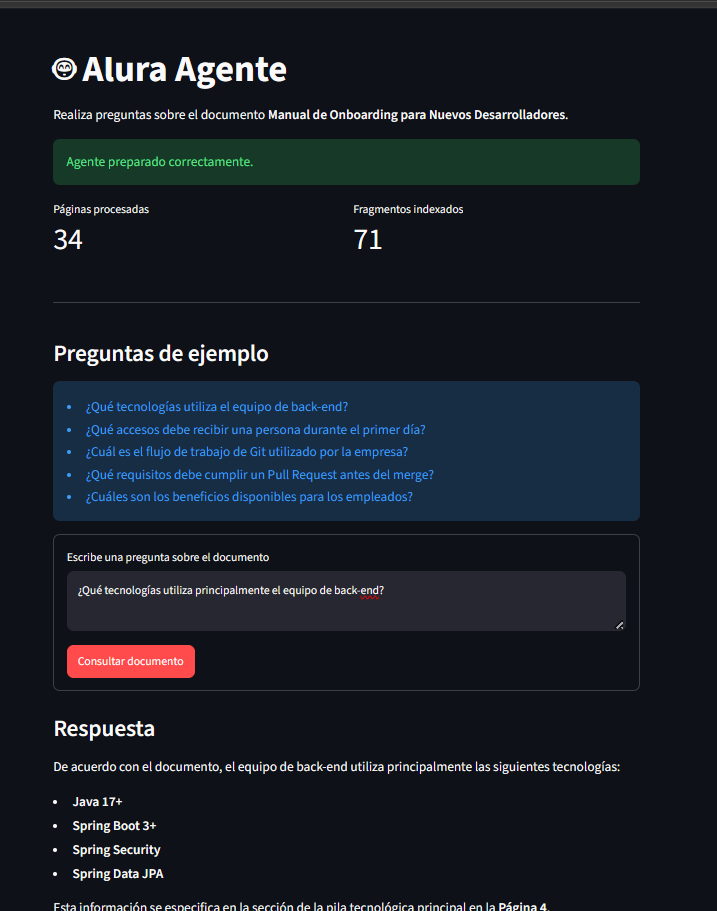
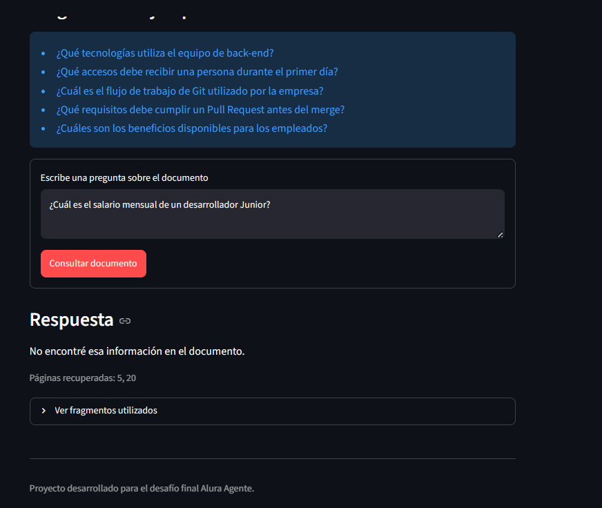

# 🤖 Alura Agente

Aplicación de inteligencia artificial que permite realizar preguntas en lenguaje natural sobre un documento PDF y obtener respuestas basadas en su contenido.

Este proyecto fue desarrollado para el desafío final **Alura Agente**.

## 📌 Problema

Las empresas almacenan grandes cantidades de información en manuales, informes, políticas y otros documentos.

Encontrar un dato específico puede requerir revisar manualmente muchas páginas, lo que provoca pérdida de tiempo y dificulta el acceso rápido a la información.

## 💡 Solución

Alura Agente procesa un documento PDF y crea una base de conocimiento que permite:

- Extraer el texto del documento.
- Dividir el contenido en fragmentos.
- Crear representaciones vectoriales mediante embeddings.
- Buscar los fragmentos relacionados con la pregunta.
- Generar una respuesta utilizando Google Gemini.
- Mostrar las páginas y fragmentos utilizados.

El agente está configurado para responder únicamente con información encontrada dentro del documento.

## 📄 Documento utilizado

Para las pruebas se utilizó el documento:

**Manual de Onboarding para Nuevos Desarrolladores — Santo Pegasus Soluciones**

El documento contiene información sobre:

- Cultura y estructura de la empresa.
- Tecnologías utilizadas.
- Accesos del primer día.
- Configuración de entornos back-end y front-end.
- GitFlow y Conventional Commits.
- Proceso de Pull Requests y Code Review.
- Beneficios y políticas.
- Seguridad.
- Plan de onboarding.

> ⚠️ El documento está clasificado como interno y confidencial, por lo que no se incluye en este repositorio público. :contentReference[oaicite:0]{index=0}

## 🏗️ Arquitectura

```text
Documento PDF
      ↓
PyPDFLoader extrae el texto
      ↓
RecursiveCharacterTextSplitter divide el contenido
      ↓
Gemini genera los embeddings
      ↓
FAISS almacena los vectores
      ↓
El usuario realiza una pregunta
      ↓
FAISS recupera los fragmentos relacionados
      ↓
Gemini genera la respuesta
      ↓
Streamlit muestra la respuesta y las páginas consultadas
```

## 🛠️ Tecnologías utilizadas

- Python
- Streamlit
- LangChain
- PyPDF
- FAISS
- Google Gemini API
- Google Generative AI Embeddings
- Python Dotenv
- Git
- GitHub
- Oracle Cloud Infrastructure

## 📁 Estructura del proyecto

```text
alura-agente/
├── capturas/
│   ├── respuesta_tecnologias.png
│   ├── respuesta_accesos.png
│   └── respuesta_no_encontrada.png
├── documentos/
│   └── manual_onboarding_desarrolladores.pdf
├── app.py
├── requirements.txt
├── .env.example
├── .gitignore
└── README.md
```

El documento PDF y el archivo `.env` no se publican porque contienen información privada.

## ⚙️ Requisitos

Para ejecutar el proyecto se necesita:

- Python 3.10 o superior.
- Git.
- Una clave de Google Gemini API.
- Un documento PDF autorizado.

## 🚀 Instalación

### 1. Clonar el repositorio

```bash
git clone https://github.com/ramiroedil/alura-agente.git
cd alura-agente
```

### 2. Crear el entorno virtual

En Windows PowerShell:

```powershell
python -m venv .venv
.\.venv\Scripts\Activate.ps1
```

En Linux:

```bash
python3 -m venv .venv
source .venv/bin/activate
```

### 3. Instalar las dependencias

```bash
python -m pip install -r requirements.txt
```

### 4. Configurar las variables de entorno

Crear un archivo llamado `.env` en la raíz del proyecto:

```env
GOOGLE_API_KEY=tu_clave_real
GEMINI_MODEL=gemini-3.5-flash
GEMINI_EMBEDDING_MODEL=gemini-embedding-2
```

La clave real no debe escribirse directamente en el código ni publicarse en GitHub.

### 5. Agregar el documento PDF

Crear una carpeta llamada:

```text
documentos
```

Colocar dentro un documento PDF autorizado con el nombre:

```text
manual_onboarding_desarrolladores.pdf
```

La ruta esperada es:

```text
documentos/manual_onboarding_desarrolladores.pdf
```

Para usar un nombre diferente se debe modificar `PDF_PATH` dentro de `app.py`.

## ▶️ Ejecutar la aplicación

Con el entorno virtual activo, ejecutar:

```bash
python -m streamlit run app.py
```

La aplicación estará disponible normalmente en:

```text
http://localhost:8501
```

## ❓ Preguntas de ejemplo

El agente puede responder preguntas como:

```text
¿Qué tecnologías utiliza principalmente el equipo de back-end?
```

```text
¿Qué accesos debe recibir un desarrollador durante su primer día?
```

```text
¿Cuántas aprobaciones necesita un Pull Request antes del merge?
```

```text
¿Qué beneficios ofrece la empresa a sus empleados?
```

También se probó con una pregunta cuya respuesta no aparece en el documento:

```text
¿Cuál es el salario mensual de un desarrollador Junior?
```

Respuesta esperada:

```text
No encontré esa información en el documento.
```

## 🖼️ Evidencias

### Respuesta sobre tecnologías



### Respuesta sobre accesos


### Información no encontrada



## 🔐 Seguridad

El proyecto aplica las siguientes medidas:

- La clave API se almacena en `.env`.
- El archivo `.env` está excluido mediante `.gitignore`.
- El entorno virtual `.venv` no se publica.
- El documento confidencial no se incluye en el repositorio.
- La aplicación no tiene claves escritas directamente en el código.
- El agente recibe únicamente los fragmentos recuperados del PDF.
- Se muestran las páginas utilizadas para verificar las respuestas.

El archivo `.gitignore` incluye:

```gitignore
.env
.venv/
__pycache__/
*.pyc
documentos/manual_onboarding_desarrolladores.pdf
```

## ☁️ Despliegue en OCI

La aplicación será desplegada en una instancia de Oracle Cloud Infrastructure Compute.

Estado del despliegue:

```text
Pendiente
```

Cuando el despliegue esté terminado, se agregará aquí el enlace público o una captura de la aplicación funcionando en OCI.

## 👤 Autor

**Edil Ramiro Rosales Zambrana**

## 📚 Desafío

Proyecto desarrollado para el desafío final **Alura Agente**.